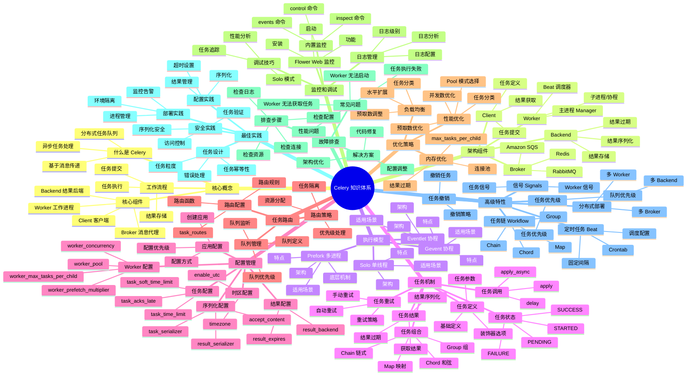
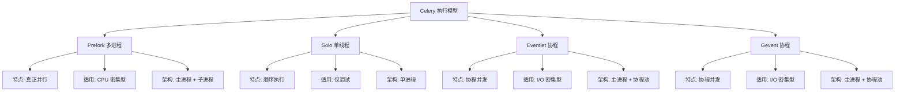
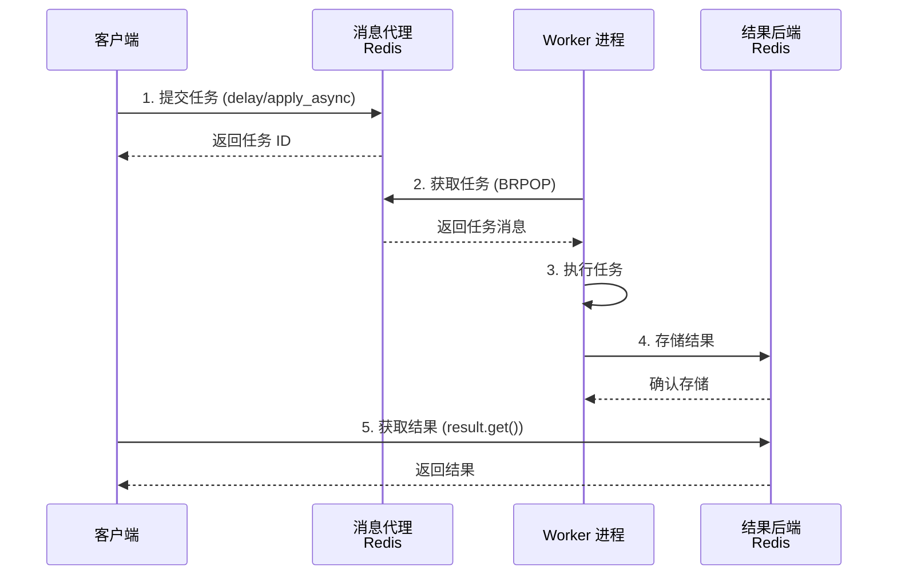
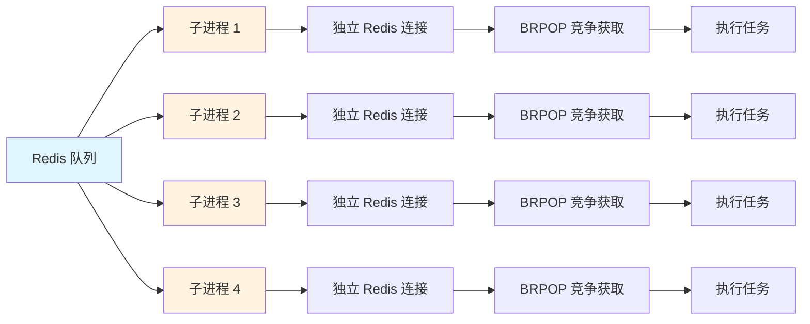
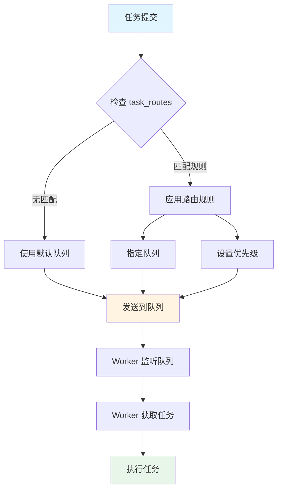
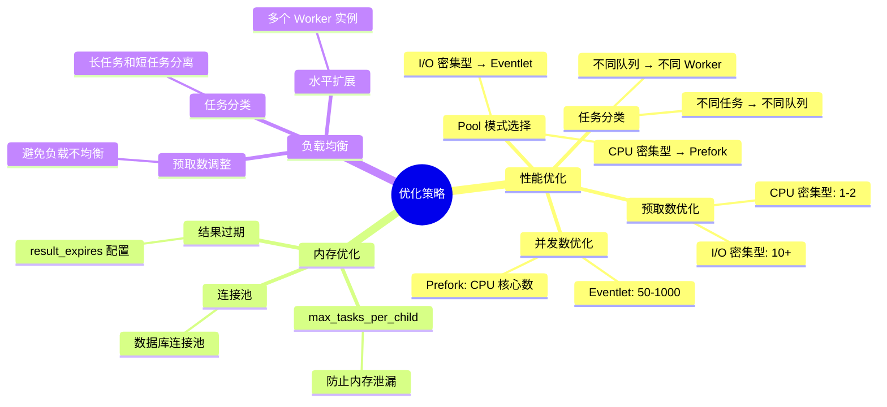
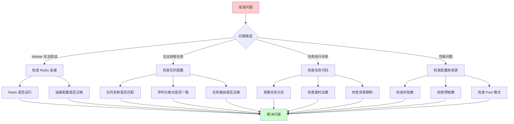
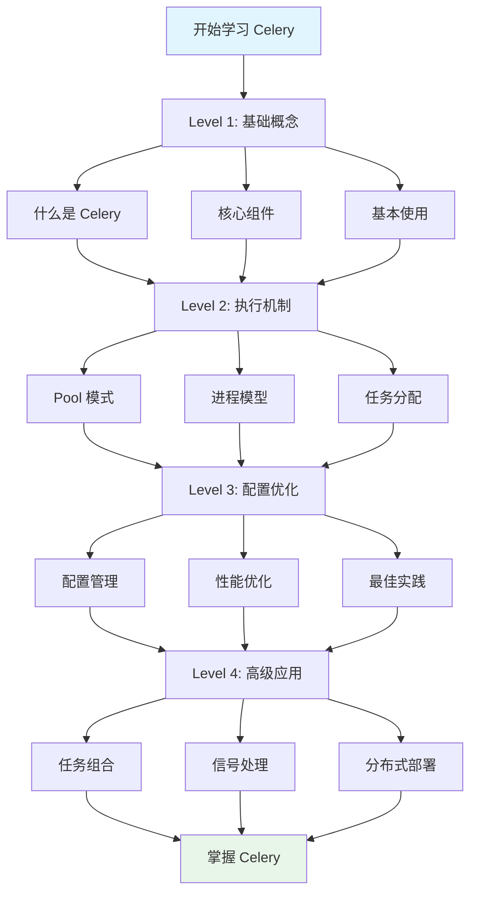

# 🗺️ Celery 知识思维导图 - 可视化版本

本文档使用 Mermaid 图表展示 Celery 知识体系，可以在支持 Mermaid 的 Markdown 查看器中查看。

---

## 📊 完整知识体系图



---

## 🔄 执行模型对比图



---

## 🏗️ 架构流程图



---

## 🔀 任务分配机制图



---

## 📋 配置层次图

```mermaid
graph TD
    A[配置优先级] --> B[任务级别配置<br/>最高优先级]
    A --> C[调用时配置]
    A --> D[应用配置]
    A --> E[默认配置<br/>最低优先级]
    
    B --> B1[@app.task 参数]
    C --> C1[apply_async 参数]
    D --> D1[app.conf.update]
    E --> E1[Celery 默认值]
    
    style B fill:#ffcccc
    style C fill:#ffffcc
    style D fill:#ccffcc
    style E fill:#ccccff
```

---

## 🎯 任务路由流程图



---

## ⚙️ 优化策略图



---

## 🔍 故障排查流程图



---

## 📚 学习路径图



---

## 🎓 知识体系总结

### 核心知识模块

1. **基础层** - 核心概念、架构组件
2. **机制层** - 执行模型、任务机制
3. **配置层** - 配置管理、任务路由
4. **优化层** - 性能优化、负载均衡
5. **实践层** - 监控调试、故障排查
6. **高级层** - 信号处理、分布式部署

### 学习建议

1. **循序渐进**: 从基础概念开始，逐步深入
2. **理论结合实践**: 理解机制的同时动手实践
3. **问题驱动**: 通过解决问题加深理解
4. **持续优化**: 不断优化配置和性能

---

**可视化思维导图完成！** 🎉

在支持 Mermaid 的 Markdown 查看器（如 VS Code、GitHub、GitLab）中查看，效果更佳！

